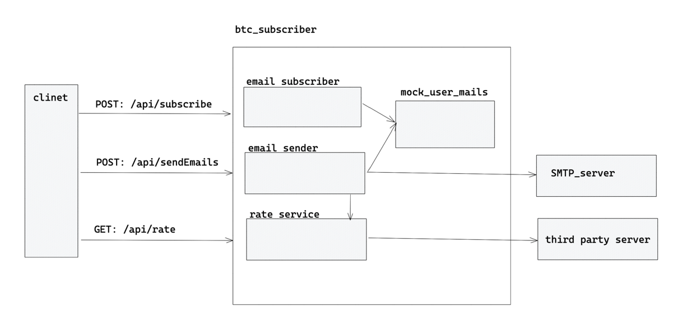

### technology stack

- java 17
- spring (boot, mvc, mail)
- assertj - to test in more declarative way
- docker


### design overview


##### endpoints:

| Endpoint                                  | Method  | URL                                 |
|-------------------------------------------|---------|-------------------------------------|
| Get BTC UAH rate                          | `GET`   | `/api/rate`                         |
| Add user subscription email               | `POST`  | `/api/subscription`                 |
| Send emails to subscribed users           | `POST`  | `/api/sendEmails`                   |


### how to run
#### local run
1. update `application.properties` file with following data:
- spring.mail.username=
- spring.mail.password=

2. run from docker local image

- clone git repository
- run `./mvnw clean install`
- run `docker build -t btc-subscriber .` to create an image
- run `docker run btc-subscriber`

example:
```shell
./mvnw clean install && docker build -t btc-subscriber .
docker run btc-subscriber

```

### furthest improvements
- add security on web apis
- create persistent user mail subscriptions with using database
- think about async monitoring of btc rate changing and automatic user notification
- extend retrieving btc rate for other currencies